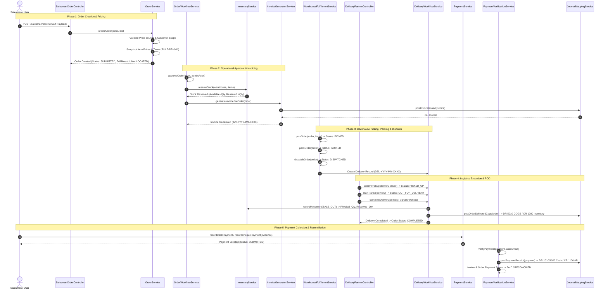

# Master System Workflow Specification

## 1. System Overview & End-to-End Mission

**Unique Distributors** is an authoritative, multi-tenant-scoped wholesale distribution and commerce management platform. The system coordinates the complete wholesale lifecycle across seven interconnected domains:

```text
[Field Sales] ──> [Operational Review] ──> [Warehouse WMS] ──> [Delivery Logistics]
      │                     │                     │                     │
      v                     v                     v                     v
[Customer Scope]     [Inventory Reserve]    [Pallet Staging]     [Physical Stock Out]
                            │                                           │
                            v                                           v
                   [Commercial Invoice]                       [COGS Journal Posting]
                            │                                           │
                            v                                           v
                   [AR Ledger & GL Rev]                       [Payment & Reconciliation]
```

### Core Architecture Characteristics
1. **Server-Side Authority (RULE-SEC-001 & RULE-SEC-002):** All price calculations, tax computations, discount limits, inventory reservations, state transitions, and journal entries are computed exclusively on the server within atomic PostgreSQL transactions.
2. **Deterministic Locking & Concurrency Control:** High-concurrency operations (order approval, picking, dispatch, delivery completion) acquire pessimistic row locks (`lockForUpdate()`) across models in a deterministic ascending-ID order to guarantee deadlock freedom.
3. **Non-Destructive Transactional History (RULE-DOM-001):** Baseline ordered quantities and submitted transaction snapshots are immutable. Cancellations, partial fulfillments, and post-submission amendments use explicit adjustments (`OrderAdjustment`), allocations (`OrderItemAllocation`), and journal corrections.
4. **Authoritative Double-Entry Accounting:** Commercial events (order invoicing, delivery completion, payment verification, returns, credit notes) automatically trigger balanced General Ledger journal entries (`JournalEntry` & `JournalLine`).

---

## 2. Master Domain Interconnection Matrix

| Phase | Operational Domain | Primary Actor | Trigger Event | Primary Mutated Entities | Downstream Handshake |
|---|---|---|---|---|---|
| **01** | **Field Sales** | Salesman / Admin | Order Cart Submission | `orders`, `order_items` | Dispatches in-app notifications to Admins & Warehouse Managers |
| **02** | **Operations Control** | Admin / Manager | Order Approval | `orders`, `order_item_allocations`, `inventory_balances` | Reserves inventory balances; triggers automatic commercial invoice generation |
| **03** | **Invoicing & AR** | System / Accountant | Order Approval / Manual | `invoices`, `invoice_items`, `receivable_transactions`, `journal_entries` | Posts trade receivable to AR ledger and wholesale sales revenue to General Ledger |
| **04** | **Warehouse WMS** | Warehouse Operator | Picking, Packing & Dispatch | `orders`, `order_item_allocations`, `deliveries`, `delivery_items` | Transitions order to `DISPATCHED`; creates new `Delivery` mission record |
| **05** | **Logistics Fleet** | Delivery Partner | Delivery Route & POD Capture | `deliveries`, `delivery_events`, `inventory_balances`, `inventory_movements`, `journal_entries` | Deducts physical inventory (`SALE_OUT`); posts Cost of Goods Sold (COGS) GL journal |
| **06** | **Payment & Cash** | Salesman / Accountant | Payment Submission & Verification | `payments`, `receivable_transactions`, `journal_entries`, `invoices`, `orders` | Clears invoice balance due; posts cash/bank GL receipt; updates order payment status |
| **07** | **Returns & RMA** | Salesman / Admin | Customer Return & Inspection | `return_requests`, `return_request_items`, `credit_notes`, `inventory_movements` | Restocks inventory (`RETURN_IN`); issues Credit Note and contra-revenue GL journal |

---

## 3. End-to-End Operational Trace



---

## 4. Master Data Invariants & Guarantees

1. **Non-Negative Available Inventory (RULE-INV-001):** `available_quantity = physical_quantity - reserved_quantity`. Row locks ensure concurrent orders can never allocate beyond available stock.
2. **Historical Financial Immutability (RULE-PRI-001 & RULE-TAX-002):** Once an order or invoice is issued, product catalog price changes or tax configuration edits do not alter historical records.
3. **Double-Entry Balance Verification (RULE-ACC-001):** Every journal entry asserts `sum(debit) == sum(credit)` to two decimal places (`bccomp == 0`). Posted journals cannot be updated or deleted.
4. **Document Compliance (RULE-DOC-001):** Invoices strictly display SKU, description, unit price, quantity, tax rate, tax breakdown, and total line items. Product images are omitted.
5. **Secure Payment Evidence (RULE-PAY-001 & RULE-PAY-002):** Cheque and Money Order payments require valid JPEG evidence verified via magic byte inspection (`\xFF\xD8\xFF`) and stored in private S3 storage.

---

## 5. Domain Directory & Detailed Specifications

- [01 — Order Workflow Specification](file:///f:/Wholesale%20Distribution%20Management%20System/docs/workflows/ORDER_WORKFLOW.md)
- [02 — Fulfillment & WMS Workflow Specification](file:///f:/Wholesale%20Distribution%20Management%20System/docs/workflows/FULFILLMENT_WORKFLOW.md)
- [03 — Delivery Logistics Workflow Specification](file:///f:/Wholesale%20Distribution%20Management%20System/docs/workflows/DELIVERY_WORKFLOW.md)
- [04 — Payment & Reconciliation Workflow Specification](file:///f:/Wholesale%20Distribution%20Management%20System/docs/workflows/PAYMENT_WORKFLOW.md)
- [05 — Invoice & Commercial Billing Workflow Specification](file:///f:/Wholesale%20Distribution%20Management%20System/docs/workflows/INVOICE_WORKFLOW.md)
- [06 — Multi-Warehouse Inventory Workflow Specification](file:///f:/Wholesale%20Distribution%20Management%20System/docs/workflows/INVENTORY_WORKFLOW.md)
- [07 — General Ledger & Accounting Workflow Specification](file:///f:/Wholesale%20Distribution%20Management%20System/docs/workflows/ACCOUNTING_WORKFLOW.md)
- [08 — In-App Domain Notification Workflow Specification](file:///f:/Wholesale%20Distribution%20Management%20System/docs/workflows/NOTIFICATION_WORKFLOW.md)
- [09 — Authorization & Resource Scoping Specification](file:///f:/Wholesale%20Distribution%20Management%20System/docs/workflows/AUTHORIZATION_WORKFLOW.md)
- [10 — Customer Returns & RMA Workflow Specification](file:///f:/Wholesale%20Distribution%20Management%20System/docs/workflows/RETURN_WORKFLOW.md)
